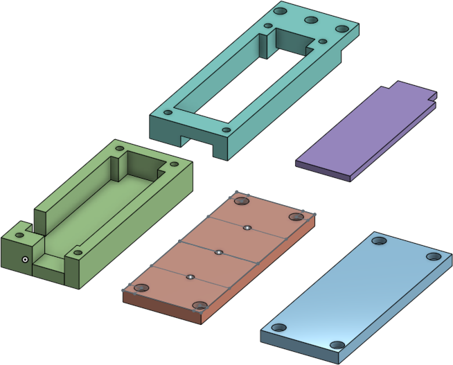

# Redesigned Barnacle

Prometheus environment sensor with printed case, optional display
with graph, and related utilities.

Cross-platform for MicroPython on ESP32-POE and CircuitPython on M4
Express.

## Contents

- [Redesigned Barnacle](#redesigned-barnacle)
  - [Contents](#contents)
  - [TODO](#todo)
  - [Device Setup](#device-setup)
  - [Metrics](#metrics)
    - [Metric Names](#metric-names)
    - [Metric Labels](#metric-labels)
  - [Hardware](#hardware)
    - [Supported Boards](#supported-boards)
    - [Supported Sensors](#supported-sensors)
    - [ESP32-POE Case](#esp32-poe-case)
  - [Utilities](#utilities)

## TODO

- hardware:
  - esp32-poe case
    - waterproof shell
  - m4 express case
- metrics:
  - power:
    - battery level
    - solar source
- ota update
  - endpoint authentication
  - app & config update (probably not libs)

## Device Setup

1. configure:
    1. copy and customize `./config/000-template.yml` for this room
       1. `label_location`
       2. `net_ip`
    2. `cp ./config/${IP}-${ROOM}.yml /media/${USER}/${CARD}/config.yml`
    3. `rsync -avhL ./image/app /media/${USER}/${CARD}/app`
    4. `rsync -avhL ./image/lib /media/${USER}/${CARD}/lib`
2. connect:
    1. SD card in board
    2. ethernet to board
        - ensure device **DOES NOT** power on (no PoE)
    3. sensor module to board
    4. USB power to board
    5. `ampy -p /dev/ttyUSB0 -b 115200 put ./image/boot.py /boot.py`
    6. reboot and test
3. assemble:
    1. board in case
    2. sensor ribbon cable to board
    3. board case cover
    4. sensor module cover
4. deploy somewhere
    1. ensure power and LAN lights are on
    1. ensure `http://x.y.z.${IP}:8080/metrics` is active
    1. debug over USB port

## Metrics

Metrics are published at a Prometheus endpoint, typically `http://device:8080/metrics`.

Some help text is included with each metric, and multiple reading may be present with
different labels. For example:

```none
# HELP prometheus_express_system_cpu_frequency system CPU frequency
# TYPE prometheus_express_system_cpu_frequency gauge
prometheus_express_system_cpu_frequency 160000000
# HELP prometheus_express_system_memory_alloc allocated system memory
# TYPE prometheus_express_system_memory_alloc gauge
prometheus_express_system_memory_alloc 118992
# HELP prometheus_express_system_heartbeat system heartbeat counter
# TYPE prometheus_express_system_heartbeat counter
prometheus_express_system_heartbeat 6567
# HELP prometheus_express_system_memory_free free system memory
# TYPE prometheus_express_system_memory_free gauge
prometheus_express_system_memory_free 38576
# HELP prometheus_express_sensor_humidity humidity data from the sensors
# TYPE prometheus_express_sensor_humidity gauge
prometheus_express_sensor_humidity{location="None",sensor="None"} 0
prometheus_express_sensor_humidity{location="sensor-location",sensor="bme280"} 20.75245
# HELP prometheus_express_sensor_moisture moisture data from the sensors
# TYPE prometheus_express_sensor_moisture gauge
prometheus_express_sensor_moisture{location="None",sensor="None"} 0
# HELP prometheus_express_sensor_temperature temperature data from the sensors
# TYPE prometheus_express_sensor_temperature gauge
prometheus_express_sensor_temperature{location="None",sensor="None"} 0
prometheus_express_sensor_temperature{location="sensor-location",sensor="esp32"} 50.0
prometheus_express_sensor_temperature{location="sensor-location",sensor="bme280"} 17.93268
```

### Metric Names

- `prometheus_express_`
  - `sensor_`
    - `prometheus_express_sensor_humidity`: relative humidity
    - `prometheus_express_sensor_moisture`: soil moisture level (capacitive or resistive)
    - `prometheus_express_sensor_temperature`: temperature reading
  - `system_`
    - `prometheus_express_system_cpu_frequency`: system CPU frequency
    - `prometheus_express_system_heartbeat`: system heartbeat
    - `prometheus_express_system_memory_alloc`: allocated (used) memory
    - `prometheus_express_system_memory_free`: free memory

### Metric Labels

- `location`: present on most `_sensor` metrics, identifies the location of the sensor module, from `config['label_location']`
- `sensor`: present on most `_sensor` metrics, identifies the hardware source within the sensor module

## Hardware

### Supported Boards

- Olimex:
  - ESP32-POE: https://www.olimex.com/Products/IoT/ESP32/ESP32-POE/open-source-hardware
- Adafruit Feather
  - M4 Express: https://www.adafruit.com/product/3857
  - **TODO:** M0 Express

### Supported Sensors

- Adafruit Stemma soil moisture: https://www.adafruit.com/product/4026
- most BME280 environment sensors:
  - Adafruit (1x, $20): https://www.adafruit.com/product/2652
  - KeeYees (3x, $13): https://www.amazon.com/gp/product/B07KYJNFMD
  - Onyehn (4x, $17): https://www.amazon.com/gp/product/B07KR24P6P
- most SSD1306 displays (OLED):
  - Adafruit 128x64 white (1x, $20): https://www.adafruit.com/product/938
  - Adafruit 128x32 white (1x, $18): https://www.adafruit.com/product/931
  - Makerfocus 128x32 blue (2x, $11): https://www.amazon.com/gp/product/B0761LV1SD
  - Geekcreit 128x64 blue w/ yellow header (1x, $6): https://www.banggood.com/0_96-Inch-4Pin-Blue-Yellow-IIC-I2C-OLED-Display-Module-p-969144.html

### ESP32-POE Case



- Onshape: https://cad.onshape.com/documents/d76ca4bd744f4af4d9935e57/w/6fa2ca68aaf1e703b4e8927f/e/7e2e7f1d76f01bc50541d834

Parts:

- base:
  - USB & RJ45 gap
  - RJ45 gap only
- mid:
  - M3 mount
  - rack mount
  - flat wall (normal)
- lid:
  - M3 mount (x3)
  - full (closed)
- spacer:
  - full
  - fork

## Utilities

- buffer
  - circular buffer with interpolated supersampling
- compat
  - platform detection
- eth
  - cross-platform connection status check
  - connection helper for static IP/DHCP
- graph
  - single bar graph
  - smoothed sparkline
- i2c
  - CircuitPython-compatible I2C bus with `try_lock`/`unlock` for MicroPython
  - bus scan/device enumerate helper
- math
  - temperature conversion
  - scale & clamp helper
  - CPython-compatible `ticks_diff`/`ticks_ms`
- mock (CPython-compatible)
  - framebuffer
  - I2C bus
  - network
- ntp
  - NTP client
  - ISO-8601 date format